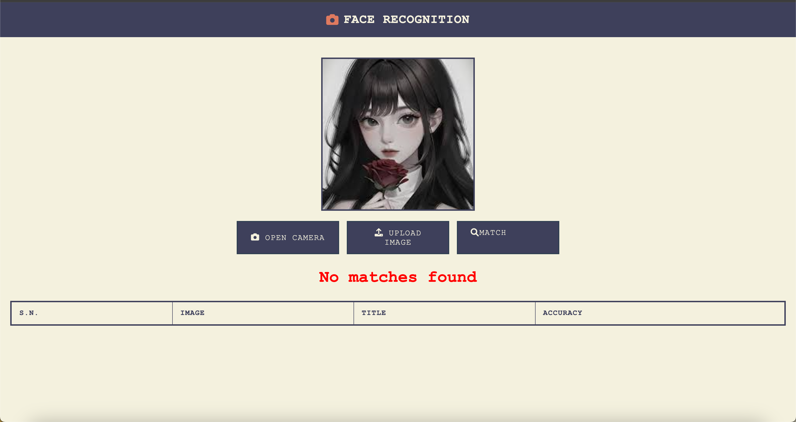
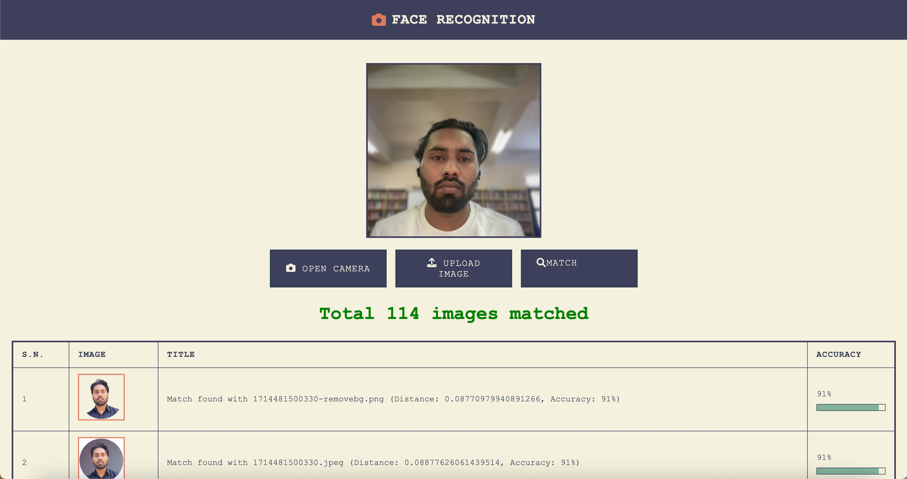

# Real-Time Face Detection and Recognition System

This project is a real-time face detection and recognition system where all functionalities are handled by the backend. The backend serves the frontend, manages user uploads, and processes face detection and recognition requests.

- **Backend**: FastAPI (handles multiple users concurrently)
- **Model**: `face_recognition` for face encoding and `faiss-cpu` for efficient similarity searches.
- **Frontend**: Simple HTML, CSS, and JavaScript, all served by the backend.
- **Image Processing**: `opencv-python`.

## Folder Structure
```plaintext
.
├── app.py                 # FastAPI application file for the backend
├── config.py              # Configuration settings
├── utils/                 # Utility modules
│   ├── face_processing.py # Face detection and recognition logic
│   ├── image_utils.py     # Image processing utilities
│   ├── logger.py          # Logging configuration
│   └── async_utils.py     # Async helper functions
├── tasks/                 # Background tasks
│   └── processing_tasks.py # Async processing tasks
├── static/                # Static assets directory
│   ├── css/               # CSS styles
│   │   └── style.css      # Main stylesheet
│   └── js/                # JavaScript files
│       └── script.js      # Main frontend logic
├── templates/             # Directory to serve HTML templates
│   └── index.html         # Main HTML file
├── dataset_images/        # Directory to store images for training/testing
├── converted_images/      # Directory to store converted images
├── uploads/               # Directory to store uploaded images
├── public/                # Public assets like screenshots
└── requirements.txt       # Python dependencies
```

## Features
1. Real-time face detection and recognition
2. Fast and accurate image matching with large datasets using FAISS
3. Simple frontend served by the backend for interaction with the API
4. Support for multiple users uploading images concurrently
5. Asynchronous processing for better performance
6. Structured logging system
7. Configurable settings via config.py

---

## Getting Started

### 1. Prerequisites
Ensure you have Python 3.8+ installed. Clone the repository and navigate to the project folder.

Install the required Python libraries by running:
```bash
pip install -r requirements.txt
```

### 2. Setting Up the Dataset
Create a folder named `dataset_images` in the project directory and add images to it. The `converted_images` directory will stored the converted image from `.heic` format. The `uploads` directory will store the images uploaded by users.

### 3. Encoding the Dataset
Run the `face.ipynb` notebook to:
1. Encode the images stored in the `dataset_images` folder.
2. Generate face embeddings for efficient similarity searches.

### 4. Starting the Backend
Start the FastAPI backend using:
```bash
uvicorn app:app --host 0.0.0.0 --port 8000 --reload
```
This will start the API server and make it accessible on your local network at:
- **Swagger UI**: `http://0.0.0.0:8000/docs`
- **Base URL**: `http://0.0.0.0:8000/`

### 5. Running the Frontend
The frontend is now served directly from the backend. Simply navigate to:
```
http://0.0.0.0:8000/
```
This will automatically serve the HTML, CSS, and JavaScript files from the backend.

---

## Usage
1. Add images to the `dataset_images` folder.
2. Run the `face.ipynb` notebook to encode images.
3. Start the FastAPI backend using the `uvicorn` command.
4. Open `http://0.0.0.0:8000/` in a browser to upload images and test face detection and recognition in real-time.

### Multiple User Support
- The backend has been optimized to handle multiple concurrent users.
- Each user can upload images and trigger face detection or recognition without blocking other users.
- All static files (HTML, CSS, JS) are served by the FastAPI backend, which ensures that everything runs seamlessly.

---

## Dependencies
The following Python libraries are required:
- `face_recognition`
- `faiss-cpu`
- `opencv-python`
- `fastapi`
- `uvicorn`
- `python-multipart`    # For handling file uploads
- `jinja2`             # For template rendering
- `python-logging`     # For structured logging
- `pillow`            # For image processing
- `numpy`             # For numerical operations

All dependencies are listed in `requirements.txt`.

## Advanced Features

### Asynchronous Processing
- Background tasks handle heavy processing operations
- Non-blocking image processing using async/await patterns
- Efficient handling of multiple concurrent requests

### Logging System
- Structured logging for better debugging and monitoring
- Separate logs for different components (face processing, image utils, etc.)
- Configurable log levels via config.py

### Configuration Management
- Centralized configuration in config.py
- Easy to modify settings for:
  - Image processing parameters
  - Face detection thresholds
  - File storage paths
  - Logging options

---

## Screenshots
1. **Swagger API Interface**
   
2. **Frontend Interface**
   
   
   
   
   

---

## Notes
- Ensure that the images in `dataset_images` are clear and properly cropped for better accuracy.
- For optimal performance, test the system with a reasonable number of images initially before scaling up to a larger dataset.
- The system supports multiple users, and all frontend files (HTML, CSS, JS) are served by the backend to make the setup easier.

## Additional Notes
- The system uses asynchronous processing for better performance with multiple users
- Logging is implemented for better debugging and monitoring
- All configurations can be modified through config.py
- The backend is optimized for concurrent processing of multiple requests
