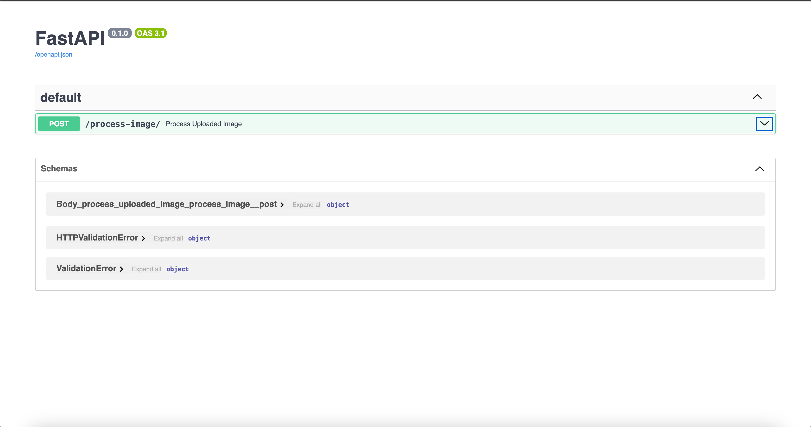

# Real-Time Face Detection and Recognition System  

This project is a real-time face detection and recognition system built using the following:  
- **Backend**: FastAPI  
- **Model**: `face_recognition` for face encoding and `faiss-cpu` for efficient similarity searches.  
- **Frontend**: Simple HTML, CSS, and JavaScript.  
- **Image Processing**: `opencv-python`.  

## Folder Structure  
```plaintext
.
├── app.py                # FastAPI application file for the backend
├── face.ipynb            # Jupyter Notebook for training and testing the face recognition model
├── dataset_images/       # Directory to store images for training/testing
├── index.html            # Frontend HTML file
├── requirements.txt      # Python dependencies
```

## Features  
1. Real-time face detection and recognition.  
2. Fast and accurate image matching with large datasets using FAISS.  
3. Simple frontend for interaction with the backend API.  

---

## Getting Started  

### 1. Prerequisites  
Ensure you have Python 3.8+ installed. Clone the repository and navigate to the project folder.  

Install the required Python libraries by running:  
```bash
pip install -r requirements.txt
```

### 2. Setting Up the Dataset  
Create a folder named `dataset_images` in the project directory and add images to it.  
Each image file should be named appropriately (e.g., `person_name.jpg`) to identify the person.  

### 3. Encoding the Dataset  
Run the `face.ipynb` notebook to:  
1. Encode the images stored in the `dataset_images` folder.  
2. Generate face embeddings for efficient similarity searches.  

### 4. Starting the Backend  
Start the FastAPI backend using:  
```bash
uvicorn app:app --reload
```  
This will start the API server, which will be accessible at:  
- **Swagger UI**: `http://127.0.0.1:8000/docs`  
- **Base URL**: `http://127.0.0.1:8000/`  

### 5. Running the Frontend  
Open the `index.html` file in any modern web browser to interact with the face detection system.  

---

## Usage  
1. Add images to the `dataset_images` folder.  
2. Run the `face.ipynb` notebook to encode images.  
3. Start the FastAPI backend using the `uvicorn` command.  
4. Open `index.html` in a browser to upload images and test face detection and recognition in real-time.  

---

## Dependencies  
The following Python libraries are required:  
- `face_recognition`  
- `faiss-cpu`  
- `opencv-python`  
- `fastapi`  
- `uvicorn`  

All dependencies are listed in `requirements.txt`.  

---

## Screenshots  
1. **Swagger API Interface**  
     
2. **Frontend Interface**  
     
   
   
   
   

---

## Notes  
- Ensure that the images in `dataset_images` are clear and properly cropped for better accuracy.  
- For optimal performance, test the system with a reasonable number of images initially before scaling up to a larger dataset.  
